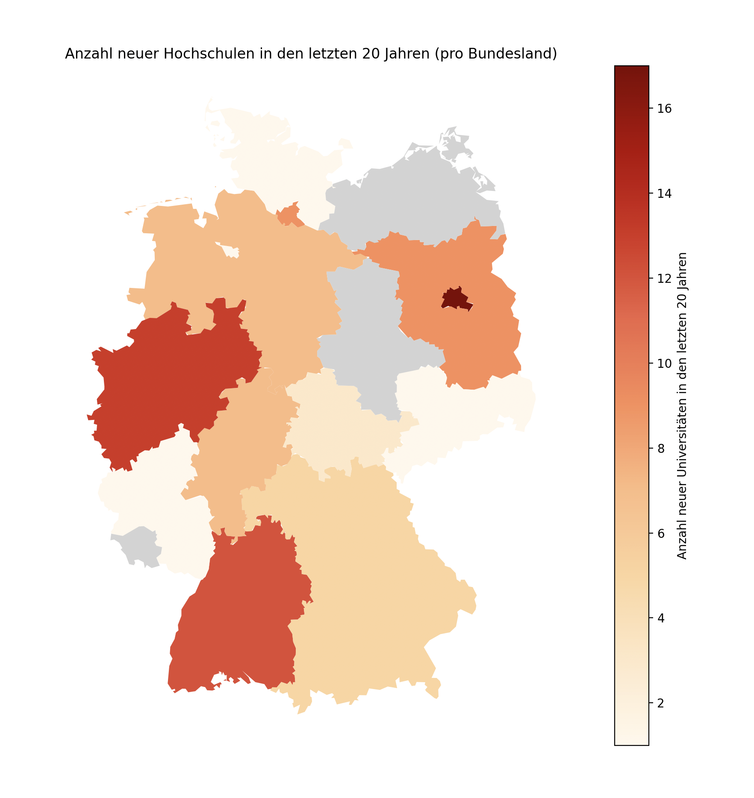
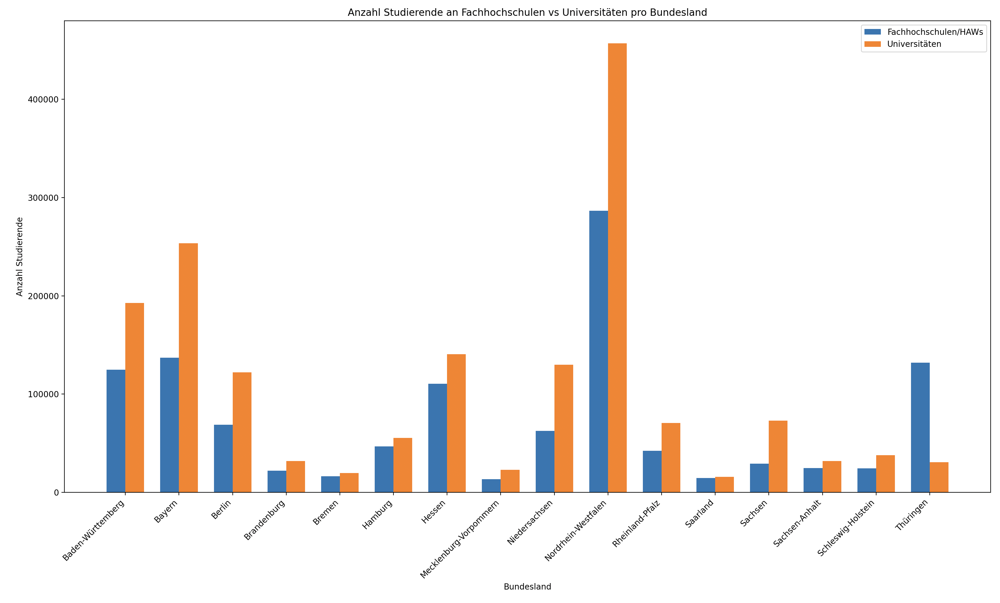
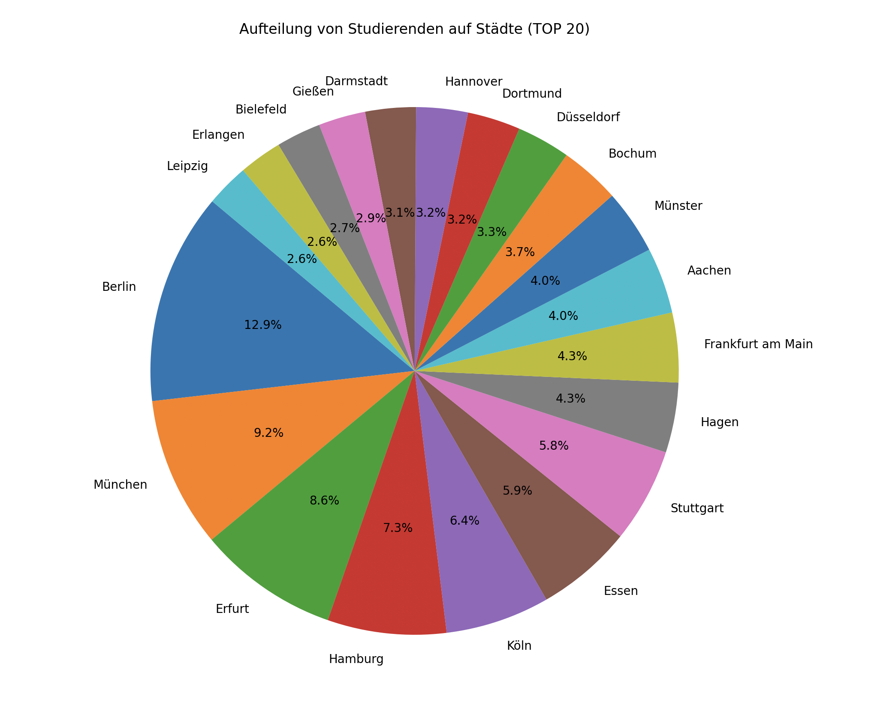

# DBS PostgreSQL Project

## Overview of Data Visualizations

### 1. Number of New Universities in the Last 20 Years (by Federal State)
This chart shows the distribution of newly established universities across different federal states over the past 20 years.



---

### 2. Number of Students in Universities vs. Universities of Applied Sciences (by Federal State)
This visualization compares the number of students enrolled in universities and universities of applied sciences in each federal state.



---

### 3. Distribution of Students Across Cities (Top 20)
This chart illustrates the distribution of students in the top 20 cities with the highest number of students.



---

# How to import the PostgreSQL database

1. Run this command to start a PostgreSQL container with a specific username and password
```shell
docker run --name my-postgres -e POSTGRES_USER=postgres -e POSTGRES_PASSWORD=password -d -p 5432:5432 postgres:latest
```

2. Copy the dump file into the container
```shell
docker cp Projekt10.dump my-postgres:/tmp/Projekt10.dump
```

3. Connect to the container
```shell
docker exec -it my-postgres bash
```

4. Use pg_restore to import the dump into your PostgreSQL database
```shell
pg_restore -U postgres -d postgres /tmp/Projekt10.dump
```

5. Configure PostgreSQL authentication
```shell
sed -i "s/trust/md5/g" /var/lib/postgresql/data/pg_hba.conf
```

6. Restart the container
```shell
docker restart my-postgres
```

7. Connect to the database inside the container
```shell
psql -U postgres -d postgres
```